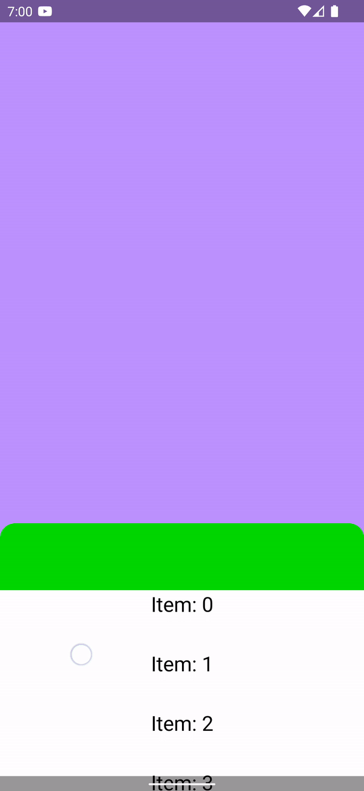

# NestedScrollBug

This sample app demonstrates a scrolling issue when using a Compose `LazyColumn` on a [`BottomSheetBehavior`](https://github.com/material-components/material-components-android/blob/master/lib/java/com/google/android/material/bottomsheet/BottomSheetBehavior.java) based bottom sheet.

The issue can be seen here:

Expected behavior: when the bottom sheet is expanded as pictured above, one can scroll through the list of content, and at any time, swipe down on the green header toolbar to collapse the bottom sheet.

Actual behavior: attempting to drag down on the green toolbar does nothing.

Related:
* [Issue #174348612](https://issuetracker.google.com/issues/174348612) relates to nested scroll issues with `Compose` content. This issue has been marked as fixed and the `rememberNestedScrollInteropConnection` changes are mentioned in the [this](https://android-developers.googleblog.com/2022/05/whats-new-in-jetpack-compose.html) Android Developers blog post. This demo project uses the afforementioned `rememberNestedScrollInteropConnection` but the issue remains.
* https://stackoverflow.com/questions/69770777/compose-lazycolumn-scrolling-behavior-inside-of-coordinatorlayout-via-composevie

