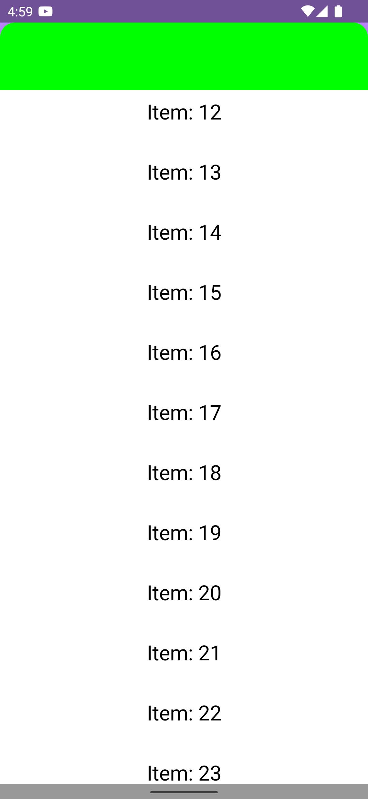

# NestedScrollBug

This sample app demonstrates an scrolling issue when using a Compose `LazyColumn` on a [`BottomSheetBehavior`](https://github.com/material-components/material-components-android/blob/master/lib/java/com/google/android/material/bottomsheet/BottomSheetBehavior.java) based bottom sheet.

Expected behavior: when the bottom sheet is expanded as pictured above, one can scroll through the list of content, and at any time, swipe down on the green header toolbar to collapse the bottom sheet.

Actual behavior: attempting to drag down on the green toolbar does nothing.

 
